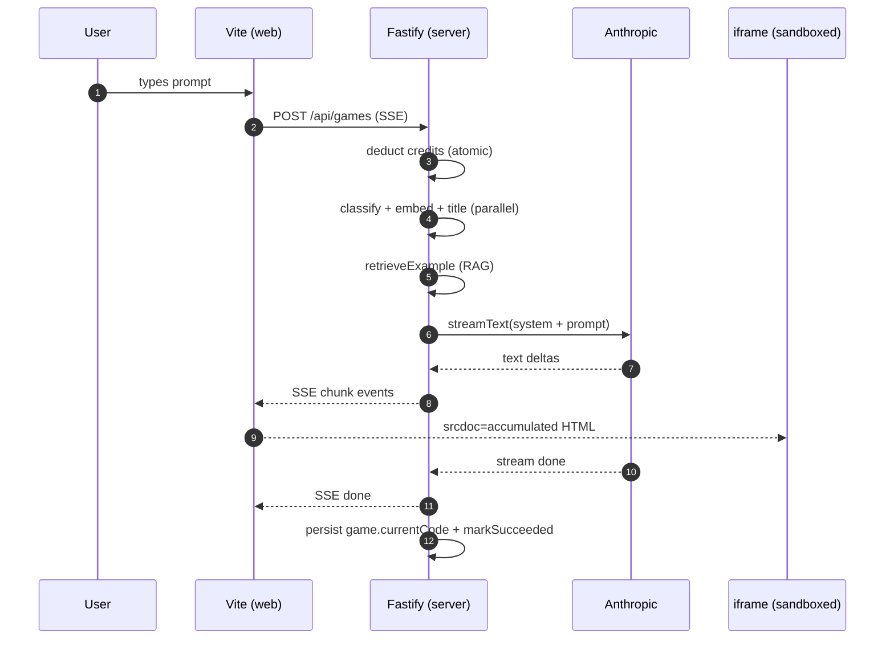

# ArcadeAI

Prompt-to-playable-game web app. Type a natural-language prompt; the server
streams a single-file HTML5 canvas game into a sandboxed iframe via SSE.
Iterate via a chat loop, manage a game library, and operate inside a
credit-based usage model.

## Why

LLMs can write a complete one-file game in seconds. The interesting product
question is everything around that: streaming UX, refinement loops, credit
economy, sharing, RAG-grounded examples for consistent quality, and not
letting cost spiral on anonymous traffic. ArcadeAI is the harness for those
questions.

## Stack

| Layer       | Choice                                                   |
| ----------- | -------------------------------------------------------- |
| Runtime     | Bun (server + scripts)                                   |
| Server      | Fastify v5                                               |
| Auth        | Better Auth (Google + GitHub OAuth, account linking)     |
| DB          | SQLite via `bun:sqlite` + Drizzle, `sqlite-vec` for RAG  |
| LLM         | Anthropic Claude (gen / refine / repair); OpenAI GPT-4.1-mini (classify / embed / title) |
| AI SDK      | Vercel AI SDK (`ai`, `@ai-sdk/anthropic`, `@ai-sdk/openai`) |
| Frontend    | React 19, Vite, TanStack Router + Query, Tailwind v4, shadcn/ui |

## Prerequisites

- [Bun](https://bun.sh) ≥ 1.1
- **macOS:** `brew install sqlite` — `sqlite-vec` requires Homebrew SQLite.
  The DB client in `packages/db/src/sqlite-vec-loader.ts` points at
  `/opt/homebrew/opt/sqlite/lib/libsqlite3.dylib`. If it's missing, the
  server crashes at startup.

## Setup

```bash
bun install
cp .env.example .env       # fill in API keys + OAuth credentials
bun run db:migrate         # creates SQLite file + runs migrations
```

### Required env vars

| Variable | Purpose |
| --- | --- |
| `BETTER_AUTH_SECRET` | Session signing. **Required in production** — server will refuse to start without it. |
| `ANTHROPIC_API_KEY` | Claude generation / refinement / repair |
| `OPENAI_API_KEY` | Classification, embeddings, titles |
| `WEB_ORIGIN` | The web app's origin (e.g. `http://localhost:5173`). Used for CORS allowlist + OAuth callbacks. |
| `DATABASE_PATH` | Absolute path to the SQLite file |
| `ADMIN_EMAILS` | Comma-separated; matching users get the `admin` tier on signup |
| `GOOGLE_CLIENT_ID` / `GOOGLE_CLIENT_SECRET` | Google OAuth |
| `GITHUB_CLIENT_ID` / `GITHUB_CLIENT_SECRET` | GitHub OAuth |

`apps/server/src/lib/env.ts` validates everything at boot via Zod and fails
fast with a clear error if anything is missing.

## Development

```bash
bun run dev
```

- Web: <http://localhost:5173>
- Server: <http://localhost:3000>

```bash
curl http://localhost:3000/api/health   # → {"ok":true,...}
```

## Common scripts

```bash
bun run build         # build all workspaces (vite + tsc --noEmit)
bun run typecheck     # tsc --noEmit only, much faster than full build
bun run lint          # biome check (no fixes)
bun run check         # biome check + apply safe fixes + format
bun run test          # bun test across workspaces

bun run db:migrate    # apply pending migrations + post-migrate (sqlite-vec)
bun run db:generate   # drizzle-kit generate (after schema edits)
bun run db:studio     # open Drizzle Studio against the local DB
```

## Architecture



## Layout

```
apps/server     — Fastify API, Bun runtime
apps/web        — React SPA, Vite + TanStack
packages/db     — Drizzle schema, migrations, sqlite-vec loader
packages/shared — Tier limits, genre buckets, model config (used by both apps)
docs/SPEC.md    — full product spec
docs/designs/   — in-flight design docs (merged into SPEC.md by sync-docs)
docs/operations.md — log shipping, backups, deployment notes
AGENTS.md       — concise onboarding for AI agents working in this repo
```

## Troubleshooting

- **Server crashes at startup with `sqlite-vec` error:** install Homebrew
  SQLite (`brew install sqlite`). See Prerequisites.
- **Server refuses to start in production with "BETTER_AUTH_SECRET is not set":**
  set `BETTER_AUTH_SECRET` in your environment. The dev fallback is
  intentionally rejected when `NODE_ENV === "production"` so a misconfig
  can't ship session cookies signed with a public key.
- **OAuth bounces back to the wrong host:** check `WEB_ORIGIN`. Better Auth's
  callback URL is built from this value; if it's wrong, you land on the
  server origin instead of the SPA.
- **Routes missing after edit:** `apps/web/src/routeTree.gen.ts` is
  auto-generated by the TanStack Router Vite plugin. Don't edit it directly;
  edit the route files under `apps/web/src/routes/` and the next dev/build
  regenerates it.
